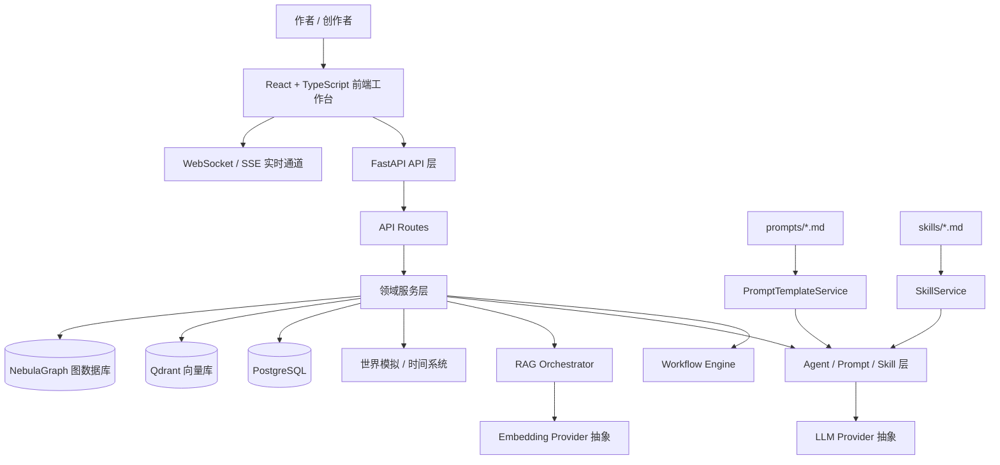

# GodView

> AI 驱动的长篇小说创作、世界模拟与多 Agent 工作流编排系统。

GodView 是一个面向长篇小说创作场景的 AI 创作工作台。它不是单纯的“大模型聊天壳”或“自动写小说脚本”，而是把小说创作拆解为项目初始化、设定沉淀、角色构建、世界观管理、剧情规划、章节写作、质量评估、读者模拟、工作流编排、人工干预和长期记忆等多个环节，并通过 FastAPI、React、RAG、多数据库和多 Agent 协作机制，把大模型能力工程化地接入创作流程。

项目目标是让 LLM 生成从一次性的文本输出，变成一个 **可编排、可追踪、可验证、可人工介入、可持续沉淀上下文** 的创作系统。

---

## 目录

- [1. 项目定位](#1-项目定位)
- [2. 核心能力速览](#2-核心能力速览)
- [3. 总体架构](#3-总体架构)
- [4. 技术栈](#4-技术栈)
- [5. 功能模块详解](#5-功能模块详解)
- [6. 后端架构](#6-后端架构)
- [7. 前端架构](#7-前端架构)
- [8. 数据层设计](#8-数据层设计)
- [9. AI、Agent、Prompt 与 Skill 系统](#9-aiagentprompt-与-skill-系统)
- [10. Workflow Engine 工作流系统](#10-workflow-engine-工作流系统)
- [11. 安装、配置与启动](#11-安装配置与启动)
- [12. 常用验证路径](#12-常用验证路径)
- [13. 代码文件索引](#13-代码文件索引)
- [14. 运行资产索引](#14-运行资产索引)
- [15. 测试与维护脚本](#15-测试与维护脚本)
- [16. 常见问题](#16-常见问题)
- [17. 当前工程状态说明](#17-当前工程状态说明)
- [18. 一句话总结](#18-一句话总结)

---

## 1. 项目定位

### 1.1 GodView 是什么

GodView 是一个面向长篇小说创作的 AI 多 Agent 工作流平台，提供从“创作资产构建”到“章节生成与质量反馈”的完整工作台能力。

它围绕以下核心问题设计：

| 长篇创作问题 | GodView 的处理方式 |
|---|---|
| 设定容易遗忘 | 通过 Lore、Memory、Writing Rules 和 RAG 组织长期上下文 |
| 角色前后不一致 | 通过角色档案、角色深度、关系图谱和记忆服务维护人物状态 |
| 剧情推进难以管理 | 通过 Plot、Outline、Hook、Volume、StateChange 等模块追踪叙事结构 |
| AI 输出不可控 | 通过 Prompt、Skill、Agent Template、结构化输出、质量检查和人工干预提高可控性 |
| 多步骤创作流程复杂 | 通过 Workflow Engine 把任务拆成可执行、可观察、可重试的节点 |
| 创作需要人机协作 | 在设定保存、质量评估、异常分支和干预日志中保留 Human-in-the-loop |

### 1.2 GodView 不是什么

为了避免误解，GodView 当前更准确地说是一个 AI 创作工作流原型/工程系统，而不是：

- 面向公众用户的大规模商业 SaaS。
- 已经承诺高并发、高可用的生产级系统。
- 完全替代作者的自动写作工具。
- 通用 Agent 平台。
- 模型训练或微调平台。
- 单纯的大模型聊天界面。

---

## 2. 核心能力速览

| 能力域 | 用户能做什么 | 前端入口 | 后端/API 与服务 |
|---|---|---|---|
| 项目管理 | 创建、选择、查看小说项目 | `ProjectSetup.tsx`、`Dashboard.tsx` | `projects.py`、`project.py` |
| Bootstrap 初始化 | 从项目想法、设定、大纲启动创作工程 | `Bootstrap.tsx` | `bootstrap.py`、`bootstrap_orchestrator.py` |
| 角色管理 | 管理人物档案、重要性、语音样本、所在地 | `Characters.tsx`、`CharacterVoice.tsx` | `characters.py`、`character.py`、角色相关服务 |
| 世界观管理 | 管理世界、区域、地点、地理关系 | `Worlds.tsx`、`WorldMap.tsx` | `worlds.py`、`world.py`、`world_expansion_service.py` |
| 设定库 Lore | 管理静态设定、优先级、分类、冲突 | `Lore.tsx`、`LoreTree.tsx` | `lore.py`、`lore_rag.py`、`lore_index_service.py` |
| Setting Agent | 用对话方式提取设定、角色、伏笔并等待确认 | `SettingAgentChat.tsx` | `setting_agent.py`、`setting_agent_service.py` |
| 剧情与伏笔 | 管理剧情、章节、伏笔和状态变化 | `Plots.tsx`、`Hooks.tsx` | `plots.py`、`state_changes.py`、`plot.py` |
| 章节大纲 | 生成、校验、管理章节大纲 | `Outlines.tsx` | `chapter_outlines.py`、`plot_outline_service.py` |
| 工作流编排 | 可视化搭建和执行 Agent 工作流 | `Visualizer.tsx`、`Director.tsx` | `workflows.py`、`workflow_engine.py` |
| Director 上帝模式 | 观察世界状态、工作流状态、干预创作过程 | `Director.tsx` | `director.py`、`websocket.py`、`interventions.py` |
| 质量评估 | 章节质量、爽点、黄金三章、读者反馈 | `ChapterEvaluator.tsx`、`ReaderSimulator.tsx` | `quality_checks.py`、`golden_three_rules.py`、Skill 体系 |
| Prompt 管理 | 管理系统 Prompt 模板、渲染和分类 | `Prompts.tsx` | `prompts.py`、`prompt_template_service.py` |
| Skill 管理 | 管理、检索、执行可复用 Agent 能力 | `Skills.tsx` | `skills.py`、`skill_service.py`、`skill_retrieval.py` |
| Agent 模板 | 管理 Agent 类型、模板、项目级配置 | `AgentTemplates.tsx`、`AgentConfigPanel.tsx` | `agent_templates.py`、`agent_configs.py` |
| 写作规则 | 管理写作约束、规则集和 RAG 检索 | `WritingRules.tsx` | `writing_rules.py`、`writing_rule_service.py` |
| 世界模拟 | 时间推进、世界状态、观察模式 | `WorldView.tsx`、`ObservationMode.tsx` | `time.py`、`simulation.py`、`world_simulation.py` |
| 小说编辑 | 章节编辑、预览和版本对比 | `NovelView.tsx`、`DiffTool.tsx` | `chapters.ts`、`novel_file_manager.py` |
| Token 统计 | 统计模型调用 token 和成本 | `TokenStats.tsx` | `token_usage.py`、`token_tracker.py` |

---

## 3. 总体架构

### 3.1 架构总览



### 3.2 启动初始化流程

`app/api/app.py` 的 `lifespan()` 是后端初始化中心，启动时按顺序完成：

1. 初始化 PostgreSQL 连接并建表。
2. 初始化 NebulaGraph 连接和图谱 schema。
3. 创建 Embedding Service。
4. 初始化 Qdrant collection。
5. 同步写作规则向量索引。
6. 从 Markdown 和数据库加载 Prompt 模板。
7. 初始化系统 Agent 模板。
8. 初始化项目级 Agent 配置。
9. 从 Markdown 和数据库加载 Skill。
10. 注册所有 FastAPI 路由并开始服务。

这意味着 GodView 的 Prompt、Skill、Agent Template、Writing Rules 不只是文档，而是运行时资产。

---

## 4. 技术栈

### 4.1 后端

| 技术 | 用途 |
|---|---|
| FastAPI | HTTP API、WebSocket、生命周期管理 |
| Pydantic v2 | 数据模型、请求响应校验、配置模型 |
| SQLAlchemy Async | PostgreSQL 异步访问 |
| asyncpg / psycopg2 | PostgreSQL 驱动 |
| Qdrant Client | 向量库访问和语义检索 |
| NebulaGraph Python Client | 图数据库访问 |
| LangChain | LLM 调用抽象与消息封装 |
| OpenAI / Anthropic SDK | 模型接入能力 |
| sentence-transformers / torch | 本地 Embedding 模型 |
| pytest / pytest-asyncio | 后端测试与集成验证 |

### 4.2 前端

| 技术 | 用途 |
|---|---|
| React 18 | 前端 SPA |
| TypeScript | 类型安全和接口约束 |
| Vite | 开发服务器与构建工具 |
| React Router | 页面路由 |
| Axios | HTTP API Client |
| React Flow | 工作流画布与节点编排 |
| Framer Motion | 页面和组件动画 |
| Tailwind CSS | 样式系统 |
| Lucide React | 图标库 |
| Zustand | 轻量状态管理依赖 |
| Playwright | 浏览器流程验证依赖 |

### 4.3 存储与基础设施

| 服务 | 默认端口 | 用途 |
|---|---:|---|
| PostgreSQL + pgvector | 5432 | 项目、角色、剧情、设定等结构化数据 |
| Qdrant | 6333 / 6334 | Lore、Memory、Narrative、Writing Rules 等向量检索 |
| NebulaGraph graphd | 9669 | 角色关系、地点关系、事件关联、记忆关联 |
| FastAPI | 8000 | 后端 API 和 WebSocket |
| Vite | 5173 | 前端开发服务器 |

---

## 5. 功能模块详解

### 5.1 项目初始化与 Bootstrap

**目标：** 把一个小说想法逐步转换为可管理的项目资产。

用户可以创建项目，进入 Bootstrap 流程，与 Setting Agent 对话补全设定，上传或录入大纲，确认种子信息，并生成项目初始角色、设定、世界观和伏笔。

| 层 | 文件 | 能力 |
|---|---|---|
| 前端页面 | `frontend/src/pages/ProjectSetup.tsx` | 项目创建、删除、选择入口 |
| 前端页面 | `frontend/src/pages/Bootstrap.tsx` | 多阶段项目初始化向导 |
| 前端组件 | `frontend/src/components/bootstrap/SeedConfirmDialog.tsx` | 种子信息确认弹窗 |
| API | `app/api/routes/projects.py` | 项目 CRUD 与摘要 |
| API | `app/api/routes/bootstrap.py` | Bootstrap 会话、消息、大纲上传、种子确认 |
| 服务 | `app/services/bootstrap_orchestrator.py` | Bootstrap 流程编排 |
| 模型 | `app/models/project.py`、`app/models/bootstrap.py`、`app/models/seed.py` | 项目、会话、种子资产模型 |

### 5.2 角色系统

**目标：** 让角色不是一段文本，而是可追踪、可扩展、可参与剧情的结构化对象。

能力包括角色创建、编辑、查询，角色重要性、叙事权重、状态管理，角色语音样本和表达风格管理，角色所在地与世界区域关联，角色深度、成长弧和关系分析，反派管理和章节反派弧设计。

| 层 | 文件 | 能力 |
|---|---|---|
| 前端页面 | `frontend/src/pages/Characters.tsx` | 角色列表、编辑、位置关联、Agent 配置入口 |
| 前端页面 | `frontend/src/pages/CharacterVoice.tsx` | 角色语音与风格样本管理 |
| 前端组件 | `frontend/src/components/VillainManager.tsx` | 反派管理面板 |
| API | `app/api/routes/characters.py` | 角色 API 与区域校验 |
| API | `app/api/routes/character_depth.py`、`app/api/routes/villains.py` | 角色深度、反派 Skill 能力 |
| 模型 | `app/models/character.py`、`app/models/character_depth.py` | 角色、关系、深度模型 |
| 服务 | `app/services/character_depth_service.py`、`character_selector.py`、`character_promotion.py`、`character_hierarchy_service.py` | 角色深度、选择、晋升、层级服务 |
| Agent | `app/agents/character_agent.py` | 角色 Agent 行为封装 |

### 5.3 世界观、区域与地图

**目标：** 用结构化世界、区域、地点和关系图谱支撑长篇叙事。

能力包括世界基础信息、标签、力量体系、技术水平、历史、地理设定，区域和地点管理，地图坐标、区域连接、角色所在地显示，世界扩展和地图管理 Agent。

| 层 | 文件 | 能力 |
|---|---|---|
| 前端页面 | `frontend/src/pages/Worlds.tsx` | 世界信息表单、标签和设定分析 |
| 前端页面 | `frontend/src/pages/WorldMap.tsx` | 区域地图、地点、连接关系管理 |
| 前端页面 | `frontend/src/pages/WorldView.tsx` | 世界时间和模拟状态观察 |
| 前端组件 | `MapView.tsx`、`NetworkGraph.tsx`、`TagSelector.tsx` | 地图、网络、标签 UI |
| API | `app/api/routes/worlds.py`、`world_expansion.py` | 世界和世界扩展 API |
| 模型 | `app/models/world.py`、`world_expansion.py` | 世界、区域、扩展模型 |
| 服务 | `app/services/world_expansion_service.py`、`world_templates.py` | 世界扩展和模板 |
| Agent | `app/agents/world_map_manager.py` | 世界地图管理 Agent |

### 5.4 Lore 设定库与 Setting Agent

**目标：** 把创作过程中的设定沉淀为可搜索、可校验、可人工确认的知识资产。

能力包括 Lore 条目分类、优先级、搜索和更新，设定冲突检测，Setting Agent 对话抽取设定、角色、伏笔，待保存内容确认，Lore 向量索引和 RAG 检索。

| 层 | 文件 | 能力 |
|---|---|---|
| 前端页面 | `frontend/src/pages/Lore.tsx` | Lore 列表、树形视图、搜索、Setting Agent 面板 |
| 前端组件 | `LoreTree.tsx`、`SettingAgentChat.tsx` | 设定树和设定 Agent 对话 |
| API | `app/api/routes/lore.py`、`setting_agent.py` | Lore 与 Setting Agent API |
| 模型 | `app/models/lore.py`、`setting_agent.py` | Lore、冲突、会话、协商模型 |
| 服务 | `setting_agent_service.py`、`lore_rag.py`、`lore_index_service.py`、`conflict_detector.py` | 设定对话、检索、索引、冲突检测 |
| Agent | `app/agents/setting_agent.py` | 设定 Agent |

### 5.5 剧情、伏笔、大纲和卷规划

**目标：** 将剧情推进拆成可管理的结构：章节、剧情、伏笔、状态变化、卷规划和大纲。

| 层 | 文件 | 能力 |
|---|---|---|
| 前端页面 | `Plots.tsx`、`Hooks.tsx`、`Outlines.tsx` | 剧情、伏笔、大纲管理 |
| 前端组件 | `VolumePlanner.tsx`、`OpeningDesigner.tsx` | 卷规划、开篇设计 |
| API | `plots.py`、`chapter_outlines.py`、`volumes.py`、`state_changes.py` | 剧情、大纲、卷规划、状态变化 API |
| 模型 | `plot.py`、`chapter_outline.py`、`outline.py`、`narrative.py` | 剧情、大纲、叙事状态模型 |
| 服务 | `plot_outline_service.py`、`outline_ingestion.py`、`narrative_state_change_service.py` | 大纲生成、导入、状态变化 |
| Agent | `master_plotter.py`、`hook_manager.py` | 主剧情规划和伏笔管理 |

### 5.6 Workflow Engine 与可视化编排

**目标：** 把章节生成、质量评估、设定补全、人工干预等复杂任务拆成可编排工作流。

能力包括工作流定义 CRUD，节点类型发现，Agent/条件/并行节点，工作流校验、执行、暂停、恢复、取消，SSE 事件流监控执行状态，工作流执行回放和导出。

| 层 | 文件 | 能力 |
|---|---|---|
| 前端页面 | `Visualizer.tsx`、`DirectorWorkflow.tsx` | 工作流画布、编辑、执行监控 |
| 前端组件 | `WorkflowEditor.tsx`、`WorkflowMonitor.tsx`、`NodePanel.tsx`、`PropertyPanel.tsx` | 工作流编辑与监控核心组件 |
| 前端节点 | `AgentNode.tsx`、`ConditionNode.tsx`、`ParallelNode.tsx` | 工作流节点 UI |
| API | `app/api/routes/workflows.py` | 工作流定义、执行、SSE、节点类型 API |
| 模型 | `workflow_definition.py`、`workflow_execution.py`、`node_types.py` | 工作流定义、执行和节点类型模型 |
| 服务 | `workflow_engine.py`、`workflow_node_catalog.py`、`workflow_node_registry.py`、`workflow_replay_export_service.py` | 执行引擎、节点目录、适配器注册、回放导出 |
| 适配器 | `workflow_adapters/plot_outline_adapter.py`、`setting_adapter.py` | 大纲和 Setting Agent 节点适配 |

### 5.7 Director 上帝模式与人工干预

**目标：** 提供对创作流程、世界状态、Agent 执行和人工干预的全局观察入口。

| 层 | 文件 | 能力 |
|---|---|---|
| 前端页面 | `frontend/src/pages/Director.tsx` | Director 控制中心 |
| 前端页面 | `frontend/src/pages/Interventions.tsx` | 干预日志和处理页面 |
| 前端组件 | `InterventionLog.tsx`、`MemoryViewer.tsx` | 干预日志、记忆查看 |
| API | `websocket.py`、`interventions.py` | 实时通信和干预 API |
| 模型 | `intervention.py`、`snapshot.py` | 干预、快照、版本 Diff 模型 |
| 服务 | `director.py`、`intervention_service.py`、`global_state_service.py` | Director、干预和全局状态服务 |

### 5.8 章节编辑、评估、读者模拟与 Diff

**目标：** 支持章节内容生成后的编辑、评估、反馈和版本比较。

| 层 | 文件 | 能力 |
|---|---|---|
| 前端页面 | `NovelView.tsx`、`ChapterEvaluator.tsx`、`ReaderSimulator.tsx`、`DiffTool.tsx` | 编辑、评估、模拟、差异对比 |
| 前端组件 | `GoldenThreeChecker.tsx`、`SatisfactionAnalyzer.tsx`、`TokenStats.tsx` | 黄金三章、满意度、Token 统计 |
| API | `quality_checks.py`、`golden_three_rules.py`、`token_usage.py` | 质量、规则、用量 API |
| 模型 | `golden_three.py`、`satisfaction.py`、`token_usage.py` | 质量规则、满意度、Token 模型 |
| 服务 | `golden_three_service.py`、`token_tracker.py`、`novel_file_manager.py` | 检查、追踪和章节文件管理 |
| Agent | `evaluator.py`、`writer.py` | 评估和写作 Agent |

### 5.9 时间系统、世界模拟与观察模式

**目标：** 为小说世界提供时间推进、世界状态变化、事件流和观察视角。

| 层 | 文件 | 能力 |
|---|---|---|
| 前端页面 | `WorldView.tsx`、`ObservationMode.tsx` | 世界时间、模拟控制、观察模式 |
| 前端组件 | `TimeControlPanel.tsx`、`SimulationControlPanel.tsx`、`EventStream.tsx`、`WorldAnalytics.tsx` | 时间控制、模拟控制、事件流、分析 |
| 前端 Hook | `useTimeWebSocket.ts` | 时间系统 WebSocket Hook |
| API | `time.py`、`simulation.py` | 时间和模拟 API |
| 模型 | `time.py`、`simulation.py` | 时间和模拟模型 |
| 服务 | `time_system.py`、`world_simulation.py`、`event_system.py` | 时间系统、世界模拟、事件系统 |

---

## 6. 后端架构

后端采用 FastAPI，核心组织方式是：

```text
app/
├── api/          # FastAPI 应用创建和路由层
├── services/     # 业务逻辑、AI 编排、RAG、工作流、记忆、模拟
├── models/       # Pydantic 数据模型和 DTO
├── database/     # PostgreSQL、Qdrant、NebulaGraph 适配器
├── agents/       # Agent 实现
├── data/         # 系统内置 Prompt、规则、模板数据
└── utils/        # 工具函数
```

| 层 | 关键文件 | 说明 |
|---|---|---|
| 入口层 | `main.py`、`app/api/app.py`、`app/config.py` | ASGI 入口、应用工厂、配置 |
| 路由层 | `app/api/routes/*.py` | 请求校验、服务调用、响应返回 |
| 服务层 | `app/services/*.py` | 业务逻辑、AI 编排、RAG、工作流、记忆、模拟 |
| 模型层 | `app/models/*.py` | Pydantic 领域模型和 DTO |
| 数据层 | `app/database/*.py` | PostgreSQL、Qdrant、NebulaGraph 适配器 |
| Agent 层 | `app/agents/**/*.py` | 角色、写作、评估、设定、剧情等 Agent |

---

## 7. 前端架构

前端是 Vite + React + TypeScript 单页应用。

```text
frontend/src/
├── main.tsx       # React 挂载入口
├── App.tsx        # 页面路由表
├── pages/         # 页面级功能模块
├── components/    # 通用组件和领域组件
├── api/           # Axios API 封装
├── hooks/         # WebSocket、节点类型、Agent 状态等 Hook
├── contexts/      # Theme 和 Project 全局上下文
├── config/        # 动画配置
├── constants/     # 常量数据
└── types/         # 前端共享类型
```

| 层 | 文件 | 说明 |
|---|---|---|
| 应用入口 | `frontend/src/main.tsx` | 注入 Router、ThemeProvider、ProjectProvider |
| 路由 | `frontend/src/App.tsx` | 页面路由表 |
| 全局布局 | `frontend/src/components/Layout.tsx` | 侧边栏、项目选择、主题切换、数据库状态 |
| 上下文 | `ThemeContext.tsx`、`ProjectContext.tsx` | 主题和当前项目状态 |
| API 层 | `frontend/src/api/*.ts` | 按领域封装 HTTP/SSE 请求 |
| Hook 层 | `frontend/src/hooks/*.ts` | WebSocket、时间系统、Agent 状态、节点类型 |
| UI 层 | `frontend/src/components/ui/*.tsx` | Button、Input、Card、Modal、TextArea |
| 领域组件 | `workflow/`、`world/`、`quality/`、`setting/` 等 | 工作流、世界、质量、设定等业务组件 |

---

## 8. 数据层设计

GodView 使用三类数据库，不是为了堆技术，而是因为长篇创作系统存在三类不同的数据访问模式。

| 数据库 | 适合的问题 | 在 GodView 中的用途 | 关键代码 |
|---|---|---|---|
| PostgreSQL | 结构化、事务型、可查询业务数据 | 项目、角色、世界、剧情、设定、工作流、配置、Token 统计 | `app/database/postgres.py` |
| Qdrant | 语义相似度检索 | Lore、Narrative、Memory、Voice、Writing Rules 的向量检索 | `app/database/qdrant.py` |
| NebulaGraph | 多跳关系和图谱查询 | 角色关系、区域连接、事件关联、记忆关联、伏笔关联 | `app/database/nebulagraph.py` |

---

## 9. AI、Agent、Prompt 与 Skill 系统

### 9.1 LLM Provider 抽象

`app/config.py` 和 `app/services/model_router.py` 共同实现多模型配置与创建。支持 OpenAI、Anthropic、Zhipu、Qwen、DeepSeek、Moonshot、Baichuan、Yi、MiniMax、OpenRouter 等 Provider。

| 文件 | 说明 |
|---|---|
| `app/config.py` | 保存各 Provider 的 model、api_key、base_url、temperature、max_tokens 等配置 |
| `app/services/model_router.py` | 根据配置创建 LLM 实例，提供 `MissingAPIKeyModel` 等兜底模型 |
| `app/services/structured_llm.py` | 结构化 LLM 输出执行工具 |

### 9.2 Embedding Provider 抽象

Embedding 支持 OpenAI Embedding、Sentence-Transformers 本地模型和 Ollama Embedding。关键文件是 `app/services/embedding_service.py`。

### 9.3 Prompt 系统

Prompt 是运行时资产，存放在 `prompts/` 和数据库中。

| 目录 | 说明 |
|---|---|
| `prompts/identity/` | Agent 身份设定，例如 Writer、Evaluator、Setting、Summarizer |
| `prompts/instruction/` | 功能指令，例如写作、总结、剧情管理、事件生成 |
| `prompts/output/` | 输出格式约束，例如基础 JSON 输出、剧情大纲输出 |
| `prompts/constraint/` | 全局约束，例如原创性要求 |

### 9.4 Skill 系统

Skill 是可复用的 Agent 能力资产，存放在 `skills/` 和数据库中，覆盖 analysis、core、evaluation、hook、plotting、summary、writing 等类别。

| 文件 | 说明 |
|---|---|
| `app/services/skill_service.py` | Skill 加载、同步、CRUD |
| `app/services/skill_retrieval.py` | Skill 语义检索和决策结果 |
| `app/services/skill_execution_service.py` | Skill 执行 |
| `app/services/skill_orchestrator.py` | Skill 调用编排 |
| `app/services/skill_memory_integration.py` | Skill 执行结果与记忆系统集成 |

### 9.5 Agent Template 与 Agent Config

GodView 将 Agent 拆成多层：Prompt 定义身份和约束，Skill 定义可复用能力，Agent Template 定义标准行为，Agent Config 定义项目级运行时配置，Workflow Node 把 Agent 放入可执行流程。

---

## 10. Workflow Engine 工作流系统

Workflow Engine 是 GodView 的核心工程化能力之一。它把复杂创作流程拆成节点，并让节点可以被验证、调度、执行、监控和恢复。

### 10.1 节点类型

| 节点类型 | 说明 |
|---|---|
| Start/Input 节点 | 提供输入和上下文 |
| Agent 节点 | 调用特定 Agent 或 Skill 完成任务 |
| Condition 节点 | 根据前置结果决定分支 |
| Parallel 节点 | 并行执行多个任务 |
| Interaction 节点 | 处理群体讨论、场景表演等交互式流程 |
| Intervention 节点 | 需要人工确认或处理的流程点 |

### 10.2 执行能力

- 工作流定义持久化。
- 节点和边校验。
- 依赖关系解析。
- 条件分支。
- 并行节点。
- 失败重试。
- 人工干预。
- SSE 执行事件推送。
- 执行记录和回放导出。

---

## 11. 安装、配置与启动

### 11.1 环境要求

| 软件 | 建议版本 | 用途 |
|---|---|---|
| Python | 3.11+ | 后端运行 |
| Node.js | 20+ | 前端运行 |
| Docker / Docker Compose | 最新稳定版 | PostgreSQL、Qdrant、NebulaGraph |
| Git | 任意 | 代码管理 |

### 11.2 一键安装

```bash
python install.py
```

Linux/macOS：

```bash
./install.sh
```

Windows：

```bat
install.bat
```

### 11.3 手动启动数据库

```bash
docker compose up -d
```

### 11.4 后端启动

```bash
pip install -r requirements.txt
cp .env.example .env
python main.py
```

或：

```bash
uvicorn main:app --host 0.0.0.0 --port 8000 --reload
```

### 11.5 前端启动

```bash
cd frontend
npm install
npm run dev
```

### 11.6 启动脚本

| 文件 | 说明 |
|---|---|
| `start.sh` | Linux/macOS 启动脚本 |
| `start.bat` | Windows 启动脚本 |
| `stop.sh` | Linux/macOS 停止脚本 |
| `stop.bat` | Windows 停止脚本 |

### 11.7 访问地址

| 服务 | 地址 |
|---|---|
| 前端 | `http://localhost:5173` |
| 后端 API | `http://localhost:8000` |
| API 文档 | `http://localhost:8000/docs` |
| 健康检查 | `http://localhost:8000/health` |
| Qdrant | `http://localhost:6333` |

---

## 12. 常用验证路径

1. 打开 `http://localhost:8000/health`，确认后端可用。
2. 打开 `http://localhost:8000/docs`，确认 FastAPI 路由注册正常。
3. 打开 `http://localhost:5173`，确认前端能加载。
4. 在设置页配置 LLM Provider 和 Embedding Provider。
5. 在项目页创建或选择项目。
6. 进入 Bootstrap 流程创建项目基础资产。
7. 检查角色、世界、Lore、剧情、大纲页面是否能正常读写。
8. 进入 Visualizer 创建或执行工作流。
9. 进入 Director 查看工作流状态和 Agent 状态。
10. 使用章节评估、读者模拟、Diff、干预日志等页面验证创作辅助能力。

说明：以上是建议验证路径。是否完成端到端业务闭环，需要结合本地数据库状态、模型 API Key、Embedding 下载和实际运行日志确认。

---

## 13. 代码文件索引

本节按目录解释项目自有代码文件。第三方依赖、缓存、构建产物和本地生成文件不纳入索引，例如 `frontend/node_modules/`、`__pycache__/`、`.pytest_cache/`、`.claude/`、`dist/` 等。

### 13.1 根目录入口、脚本与配置

| 文件 | 说明 |
|---|---|
| `README.md` | 项目主说明文档 |
| `.env.example` | 后端环境变量模板 |
| `docker-compose.yml` | PostgreSQL、Qdrant、NebulaGraph 本地服务编排 |
| `requirements.txt` | Python 后端依赖 |
| `main.py` | FastAPI ASGI 应用入口 |
| `install.py` | 跨平台安装向导主脚本 |
| `install.sh` / `install.bat` | Linux/macOS 与 Windows 安装脚本入口 |
| `start.sh` / `start.bat` | Linux/macOS 与 Windows 启动脚本 |
| `stop.sh` / `stop.bat` | Linux/macOS 与 Windows 停止脚本 |
| `backup_database.py` | PostgreSQL、Qdrant、NebulaGraph 备份脚本 |
| `PROJECT_CONTEXT.md` | 项目上下文说明文档 |
| `character-region-world-map-validation.png` | 角色、区域、世界地图验证截图资产 |

### 13.2 后端 API 文件

| 文件 | 说明 |
|---|---|
| `app/api/__init__.py` | API 包初始化 |
| `app/api/app.py` | FastAPI 应用工厂、生命周期、路由注册、异常处理 |
| `app/api/routes/__init__.py` | 路由包聚合 |
| `app/api/routes/agent_configs.py` | 项目级 Agent 配置 API |
| `app/api/routes/agent_templates.py` | Agent 模板 API、预览和 Prompt 组合相关接口 |
| `app/api/routes/bootstrap.py` | Bootstrap 项目初始化流程 API |
| `app/api/routes/chapter_outlines.py` | 章节大纲生成、查询、校验 API |
| `app/api/routes/character_depth.py` | 角色深度、成长弧和关系扩展 API |
| `app/api/routes/characters.py` | 角色 CRUD、区域校验和角色资料 API |
| `app/api/routes/config.py` | 系统配置、LLM、Embedding、数据库状态 API |
| `app/api/routes/genre_templates.py` | 题材模板和相关 Skill 能力 API |
| `app/api/routes/golden_three_rules.py` | 黄金三章规则 API |
| `app/api/routes/interventions.py` | 人工干预记录和处理 API |
| `app/api/routes/lore.py` | Lore 设定库 API |
| `app/api/routes/memories.py` | 记忆管理 API |
| `app/api/routes/plots.py` | 剧情、章节、伏笔 API |
| `app/api/routes/projects.py` | 项目 CRUD 和摘要 API |
| `app/api/routes/prompts.py` | Prompt 模板 CRUD、过滤、渲染 API |
| `app/api/routes/quality_checks.py` | 质量检查和评估 API |
| `app/api/routes/setting_agent.py` | Setting Agent 聊天、分析、保存、协商和变更执行 API |
| `app/api/routes/simulation.py` | 世界模拟 API |
| `app/api/routes/skills.py` | Skill CRUD、检索、决策和执行 API |
| `app/api/routes/state_changes.py` | 叙事状态变化 API |
| `app/api/routes/time.py` | 世界时间系统 API |
| `app/api/routes/token_usage.py` | Token 使用统计 API |
| `app/api/routes/villains.py` | 反派相关 Skill API |
| `app/api/routes/volumes.py` | 卷规划相关 Skill API |
| `app/api/routes/websocket.py` | WebSocket 实时通信 API |
| `app/api/routes/workflows.py` | 工作流定义、执行、节点类型、SSE 和回放 API |
| `app/api/routes/world_expansion.py` | 世界观扩展 API |
| `app/api/routes/worlds.py` | 世界、区域、地点管理 API |
| `app/api/routes/writing_rules.py` | 写作规则、规则集、项目写作配置 API |

### 13.3 后端数据库文件

| 文件 | 说明 |
|---|---|
| `app/database/__init__.py` | 数据库包初始化 |
| `app/database/postgres.py` | PostgreSQL 异步连接、SQL 执行、结构化数据持久化 |
| `app/database/qdrant.py` | Qdrant 向量集合、文本向量写入和检索适配 |
| `app/database/nebulagraph.py` | NebulaGraph 连接、图空间、Tag、Edge 初始化和图查询适配 |

### 13.4 后端模型文件

| 文件 | 说明 |
|---|---|
| `app/models/__init__.py` | 模型包统一导出 |
| `app/models/agent_config.py` | 项目级 Agent 配置模型 |
| `app/models/agent_io.py` | Agent 输入输出通用模型 |
| `app/models/agent_memory.py` | Agent 记忆相关模型 |
| `app/models/agent_output_contract.py` | Agent 输出契约模型 |
| `app/models/agent_output_schemas.py` | Agent 输出结构 schema |
| `app/models/agent_template.py` | Agent 模板模型 |
| `app/models/bootstrap.py` | Bootstrap 会话、阶段、消息、请求模型 |
| `app/models/chapter_outline.py` | 章节大纲模型 |
| `app/models/character.py` | 角色、关系、状态、语音样本模型 |
| `app/models/character_depth.py` | 角色深度、成长、关系扩展模型 |
| `app/models/golden_three.py` | 黄金三章规则和检查模型 |
| `app/models/intervention.py` | 人工干预模型 |
| `app/models/lore.py` | Lore 条目、冲突、检索和校验模型 |
| `app/models/memory.py` | 项目记忆模型 |
| `app/models/narrative.py` | 叙事状态、角色状态、世界快照模型 |
| `app/models/node_types.py` | 工作流节点类型模型 |
| `app/models/outline.py` | 大纲来源、切片、检索模型 |
| `app/models/plot.py` | 剧情、章节、伏笔模型 |
| `app/models/project.py` | 项目、项目摘要、创建和更新请求模型 |
| `app/models/prompt_template.py` | Prompt 模板模型 |
| `app/models/satisfaction.py` | 满意度和读者反馈模型 |
| `app/models/seed.py` | 项目种子、候选角色、初始化资产模型 |
| `app/models/setting_agent.py` | Setting Agent 会话、冲突、协商模型 |
| `app/models/simulation.py` | 世界模拟模型 |
| `app/models/skill.py` | Skill、参数、执行日志、测试结果模型 |
| `app/models/snapshot.py` | 世界快照、干预日志、版本差异模型 |
| `app/models/time.py` | 世界时间、时间事件、时间控制模型 |
| `app/models/token_usage.py` | Token 统计和成本计算模型 |
| `app/models/workflow_definition.py` | 工作流定义、节点、边模型 |
| `app/models/workflow_execution.py` | 工作流执行、事件、状态模型 |
| `app/models/world.py` | 世界、区域、地形、规则、遭遇模型 |
| `app/models/world_expansion.py` | 世界扩展模型 |
| `app/models/writing_rule.py` | 写作规则、规则集、项目写作配置模型 |

### 13.5 后端服务文件

| 文件 | 说明 |
|---|---|
| `app/services/__init__.py` | 服务包初始化 |
| `app/services/agent_communication.py` | Agent 通信服务 |
| `app/services/agent_config_service.py` | Agent Config 缓存、CRUD 和项目级配置服务 |
| `app/services/agent_memory_service.py` | Agent 记忆服务 |
| `app/services/agent_prompt_builder.py` | Agent Prompt 和上下文构建器 |
| `app/services/agent_prompt_service.py` | Agent 运行时 Prompt 组合服务 |
| `app/services/agent_template_service.py` | Agent Template 初始化、缓存和 CRUD 服务 |
| `app/services/bootstrap_orchestrator.py` | Bootstrap 初始化流程编排器 |
| `app/services/character_depth_service.py` | 角色深度服务 |
| `app/services/character_detection.py` | 角色识别和检测辅助服务 |
| `app/services/character_hierarchy_service.py` | 角色层级管理服务 |
| `app/services/character_promotion.py` | 角色晋升和重要性变化服务 |
| `app/services/character_selector.py` | 角色选择服务 |
| `app/services/collaborator.py` | 协作式创作辅助服务 |
| `app/services/conflict_detector.py` | 设定或叙事冲突检测服务 |
| `app/services/custom_rules.py` | 自定义规则服务 |
| `app/services/director.py` | Director 上帝模式服务 |
| `app/services/embedding_service.py` | OpenAI、Sentence-Transformers、Ollama Embedding 抽象 |
| `app/services/enhanced_memory_service.py` | 增强记忆选择和检索服务 |
| `app/services/entity_system.py` | 实体系统服务 |
| `app/services/event_system.py` | 世界事件系统 |
| `app/services/global_state_service.py` | 全局状态服务 |
| `app/services/golden_three_service.py` | 黄金三章检查服务 |
| `app/services/intervention.py` | 干预辅助逻辑 |
| `app/services/intervention_service.py` | 干预记录和处理服务 |
| `app/services/location_system.py` | 地点系统服务 |
| `app/services/lore_index_service.py` | Lore 向量索引同步服务 |
| `app/services/lore_rag.py` | Lore RAG 检索服务 |
| `app/services/md_file_service.py` | Markdown 运行资产读取、缓存、同步服务 |
| `app/services/memory_service.py` | 项目记忆管理服务 |
| `app/services/memory_system.py` | 工作记忆、情节记忆、知识图谱、程序记忆模型 |
| `app/services/model_router.py` | LLM Provider 创建、base_url 标准化和缺失 Key 兜底模型 |
| `app/services/narrative_rag.py` | 动态叙事 RAG 服务 |
| `app/services/narrative_state_change_service.py` | 叙事状态变化服务 |
| `app/services/novel_file_manager.py` | 小说章节文件管理 |
| `app/services/outline_ingestion.py` | 大纲导入、切分和处理服务 |
| `app/services/plot_outline_service.py` | 章节大纲生成、缓存和校验服务 |
| `app/services/prompt_builder.py` | Prompt 构建辅助服务 |
| `app/services/prompt_template_service.py` | Prompt 模板加载、同步、缓存和渲染服务 |
| `app/services/rag_orchestrator.py` | 静态设定、动态叙事、写作规则等 RAG 总协调 |
| `app/services/setting_agent.py` | 旧/辅助 Setting Agent 服务入口 |
| `app/services/setting_agent_service.py` | Setting Agent 对话、分析、保存、协商核心服务 |
| `app/services/skill_execution_service.py` | Skill 执行服务 |
| `app/services/skill_memory_integration.py` | Skill 与记忆系统集成 |
| `app/services/skill_orchestrator.py` | Skill 调用编排、决策和模板管理 |
| `app/services/skill_retrieval.py` | Skill 语义检索、候选排序和决策服务 |
| `app/services/skill_service.py` | Skill 加载、同步、缓存、CRUD 服务 |
| `app/services/structured_llm.py` | 结构化 LLM 输出执行工具 |
| `app/services/time_system.py` | 世界时间系统 |
| `app/services/token_tracker.py` | Token 用量追踪 |
| `app/services/workflow.py` | Director 工作流抽象 |
| `app/services/workflow_engine.py` | 工作流执行引擎 |
| `app/services/workflow_node_catalog.py` | 工作流节点目录、标签标准化、节点类型选项 |
| `app/services/workflow_node_registry.py` | 工作流节点适配器注册表 |
| `app/services/workflow_replay_export_service.py` | 工作流回放导出服务 |
| `app/services/world_expansion_service.py` | 世界扩展服务 |
| `app/services/world_simulation.py` | 世界模拟引擎 |
| `app/services/world_templates.py` | 世界模板数据服务 |
| `app/services/writing_rule_index_service.py` | 写作规则向量索引同步服务 |
| `app/services/writing_rule_rag.py` | 写作规则 RAG 服务 |
| `app/services/writing_rule_service.py` | 写作规则 CRUD 和项目配置服务 |
| `app/services/writing_rules_init.py` | 系统写作规则初始化和 Prompt 构建 |
| `app/services/workflow_adapters/__init__.py` | 工作流适配器包初始化 |
| `app/services/workflow_adapters/plot_outline_adapter.py` | 大纲工作流节点适配器 |
| `app/services/workflow_adapters/setting_adapter.py` | Setting Agent 工作流节点适配器 |

### 13.6 后端 Agent 文件

| 文件 | 说明 |
|---|---|
| `app/agents/__init__.py` | Agent 包初始化 |
| `app/agents/base.py` | Agent 基类和通用接口 |
| `app/agents/character_agent.py` | 角色 Agent |
| `app/agents/evaluator.py` | 内容评估 Agent |
| `app/agents/event_generator.py` | 事件生成 Agent |
| `app/agents/procgen.py` | 程序化生成 Agent |
| `app/agents/scene_coordinator.py` | 场景协调 Agent |
| `app/agents/setting_agent.py` | 设定 Agent |
| `app/agents/world_map_manager.py` | 世界地图管理 Agent |
| `app/agents/director/__init__.py` | Director Agent 子包初始化 |
| `app/agents/director/hook_manager.py` | 伏笔管理 Agent |
| `app/agents/director/master_plotter.py` | 主剧情规划 Agent |
| `app/agents/director/summarizer.py` | 总结 Agent |
| `app/agents/director/writer.py` | 写作 Agent |

### 13.7 后端数据和工具文件

| 文件 | 说明 |
|---|---|
| `app/data/__init__.py` | 内置数据包初始化 |
| `app/data/fanqie_writing_rules.py` | 番茄风格写作规则数据 |
| `app/data/system_agent_templates.py` | 系统 Agent 模板数据 |
| `app/data/system_prompts.py` | 系统 Prompt 数据 |
| `app/data/web_novel_writing_rules.py` | 网文写作规则数据 |
| `app/data/workflow_templates.py` | 工作流模板数据 |
| `app/data/writing_rules.py` | 写作规则数据 |
| `app/utils/__init__.py` | 工具包初始化 |
| `app/utils/text_utils.py` | 文本处理工具函数 |

### 13.8 前端入口、上下文和配置文件

| 文件 | 说明 |
|---|---|
| `frontend/package.json` | 前端依赖与脚本 |
| `frontend/index.html` | Vite HTML 入口 |
| `frontend/vite.config.ts` | Vite 配置 |
| `frontend/tailwind.config.js` | Tailwind 配置 |
| `frontend/postcss.config.js` | PostCSS 配置 |
| `frontend/tsconfig.json` | TypeScript 总配置 |
| `frontend/tsconfig.app.json` | 前端应用 TypeScript 配置 |
| `frontend/tsconfig.node.json` | Node 侧 TypeScript 配置 |
| `frontend/.env.example` | 前端环境变量模板 |
| `frontend/src/main.tsx` | React 应用挂载入口 |
| `frontend/src/App.tsx` | 前端路由表 |
| `frontend/src/index.css` | 全局样式、主题变量、Tailwind 扩展样式 |
| `frontend/src/types/index.ts` | 前端共享类型 |
| `frontend/src/config/animations.ts` | Framer Motion 动画配置 |
| `frontend/src/constants/worldTags.ts` | 世界标签常量 |
| `frontend/src/contexts/ProjectContext.tsx` | 项目上下文 |
| `frontend/src/contexts/ThemeContext.tsx` | 主题上下文 |

### 13.9 前端页面文件

| 文件 | 说明 |
|---|---|
| `frontend/src/pages/AgentTemplates.tsx` | Agent 模板管理页 |
| `frontend/src/pages/Bootstrap.tsx` | 项目初始化向导页 |
| `frontend/src/pages/ChapterEvaluator.tsx` | 章节评估页 |
| `frontend/src/pages/CharacterVoice.tsx` | 角色语音样本页 |
| `frontend/src/pages/Characters.tsx` | 角色管理页 |
| `frontend/src/pages/Dashboard.tsx` | 仪表盘首页 |
| `frontend/src/pages/DiffTool.tsx` | 文本差异对比工具页 |
| `frontend/src/pages/Director.tsx` | Director 上帝模式主控页 |
| `frontend/src/pages/DirectorWorkflow.tsx` | 工作流编辑/监控/聊天组合页，目前未在主路由挂载 |
| `frontend/src/pages/Hooks.tsx` | 伏笔管理页 |
| `frontend/src/pages/Interventions.tsx` | 人工干预管理页 |
| `frontend/src/pages/Lore.tsx` | 设定库管理页 |
| `frontend/src/pages/NovelView.tsx` | 小说章节编辑页 |
| `frontend/src/pages/ObservationMode.tsx` | 世界观察模式页 |
| `frontend/src/pages/Outlines.tsx` | 章节大纲页 |
| `frontend/src/pages/Plots.tsx` | 剧情管理页 |
| `frontend/src/pages/ProjectSetup.tsx` | 项目创建和选择页 |
| `frontend/src/pages/Prompts.tsx` | Prompt 模板管理页 |
| `frontend/src/pages/ReaderSimulator.tsx` | 读者模拟页 |
| `frontend/src/pages/Settings.tsx` | LLM、Embedding、数据库等设置页 |
| `frontend/src/pages/Skills.tsx` | Skill 管理和测试页 |
| `frontend/src/pages/Visualizer.tsx` | 工作流可视化编辑页 |
| `frontend/src/pages/WorldMap.tsx` | 世界地图和区域管理页 |
| `frontend/src/pages/WorldView.tsx` | 世界模拟和时间系统页 |
| `frontend/src/pages/Worlds.tsx` | 世界观管理页 |
| `frontend/src/pages/WritingRules.tsx` | 写作规则管理页 |

### 13.10 前端组件文件

| 文件 | 说明 |
|---|---|
| `frontend/src/components/Layout.tsx` | 全局布局、侧边栏、项目选择、主题切换 |
| `frontend/src/components/PageLayout.tsx` | 页面通用布局 |
| `frontend/src/components/AgentConfigPanel.tsx` | Agent 配置面板 |
| `frontend/src/components/OpeningDesigner.tsx` | 开篇设计组件 |
| `frontend/src/components/TokenStats.tsx` | Token 统计组件 |
| `frontend/src/components/VillainManager.tsx` | 反派管理组件 |
| `frontend/src/components/VolumePlanner.tsx` | 卷规划组件 |
| `frontend/src/components/analytics/WorldAnalytics.tsx` | 世界分析组件 |
| `frontend/src/components/animations/AnimatedPage.tsx` | 页面、卡片、按钮、列表、模态等动画封装 |
| `frontend/src/components/bootstrap/SeedConfirmDialog.tsx` | Bootstrap 种子确认弹窗 |
| `frontend/src/components/editor/EventEditor.tsx` | 事件编辑器 |
| `frontend/src/components/lore/LoreTree.tsx` | Lore 树形组件 |
| `frontend/src/components/lore/index.ts` | Lore 组件导出 |
| `frontend/src/components/memory/MemoryViewer.tsx` | 记忆查看器 |
| `frontend/src/components/quality/GoldenThreeChecker.tsx` | 黄金三章检查组件 |
| `frontend/src/components/quality/SatisfactionAnalyzer.tsx` | 满意度分析组件 |
| `frontend/src/components/setting/SettingAgentChat.tsx` | Setting Agent 对话组件 |
| `frontend/src/components/setting/index.ts` | Setting 组件导出 |
| `frontend/src/components/simulation/SimulationControlPanel.tsx` | 模拟控制面板 |
| `frontend/src/components/time/TimeControlPanel.tsx` | 时间控制面板 |
| `frontend/src/components/ui/Button.tsx` | 通用按钮 |
| `frontend/src/components/ui/Card.tsx` | 通用卡片 |
| `frontend/src/components/ui/Input.tsx` | 通用输入框 |
| `frontend/src/components/ui/Modal.tsx` | 通用弹窗 |
| `frontend/src/components/ui/TextArea.tsx` | 通用文本域 |
| `frontend/src/components/ui/index.ts` | UI 组件导出 |
| `frontend/src/components/workflow/AgentChat.tsx` | Agent 聊天面板 |
| `frontend/src/components/workflow/AgentNode.tsx` | 工作流 Agent 节点 |
| `frontend/src/components/workflow/ConditionNode.tsx` | 条件节点 |
| `frontend/src/components/workflow/InterventionLog.tsx` | 干预日志组件 |
| `frontend/src/components/workflow/NodePanel.tsx` | 工作流节点选择面板 |
| `frontend/src/components/workflow/ParallelNode.tsx` | 并行节点 |
| `frontend/src/components/workflow/PropertyPanel.tsx` | 节点属性面板 |
| `frontend/src/components/workflow/WorkflowEditor.tsx` | 工作流编辑器 |
| `frontend/src/components/workflow/WorkflowHelp.tsx` | 工作流帮助说明 |
| `frontend/src/components/workflow/WorkflowMonitor.tsx` | 工作流执行监控 |
| `frontend/src/components/workflow/index.ts` | 工作流组件导出 |
| `frontend/src/components/world/EventStream.tsx` | 世界事件流 |
| `frontend/src/components/world/MapView.tsx` | 地图可视化 |
| `frontend/src/components/world/NetworkGraph.tsx` | 关系网络图 |
| `frontend/src/components/world/TagSelector.tsx` | 标签选择器 |

### 13.11 前端 API 文件

| 文件 | 说明 |
|---|---|
| `frontend/src/api/agentConfigs.ts` | Agent Config API 封装 |
| `frontend/src/api/agentTemplates.ts` | Agent Template API 封装 |
| `frontend/src/api/bootstrap.ts` | Bootstrap API 封装 |
| `frontend/src/api/chapters.ts` | 章节 API 封装 |
| `frontend/src/api/characters.ts` | 角色 API 封装 |
| `frontend/src/api/client.ts` | Axios Client、Token 注入、401 处理 |
| `frontend/src/api/config.ts` | 后端配置、Provider、数据库状态、统计 API 封装 |
| `frontend/src/api/director.ts` | Director API 封装 |
| `frontend/src/api/interventions.ts` | 干预 API 封装 |
| `frontend/src/api/lore.ts` | Lore API 封装 |
| `frontend/src/api/memories.ts` | Memory API 封装 |
| `frontend/src/api/nodeTypes.ts` | 工作流节点类型 API 封装 |
| `frontend/src/api/outlines.ts` | 大纲 API 封装 |
| `frontend/src/api/projects.ts` | 项目 API 封装 |
| `frontend/src/api/prompts.ts` | Prompt API 封装 |
| `frontend/src/api/quality.ts` | 质量评估 API 封装 |
| `frontend/src/api/settingAgent.ts` | Setting Agent API 封装 |
| `frontend/src/api/simulation.ts` | 模拟 API 封装 |
| `frontend/src/api/skills.ts` | Skill API 封装 |
| `frontend/src/api/stateChanges.ts` | 叙事状态变化 API 封装 |
| `frontend/src/api/systemConfig.ts` | 系统配置和 WebSocket URL 辅助 API |
| `frontend/src/api/time.ts` | 时间系统 API 封装 |
| `frontend/src/api/tokenUsage.ts` | Token 统计 API 封装 |
| `frontend/src/api/villains.ts` | 反派 API 封装 |
| `frontend/src/api/visualization.ts` | 可视化 API 封装 |
| `frontend/src/api/volumes.ts` | 卷规划 API 封装 |
| `frontend/src/api/workflows.ts` | 工作流 API、SSE EventSource 封装 |
| `frontend/src/api/worlds.ts` | 世界和区域 API 封装 |
| `frontend/src/api/writingRules.ts` | 写作规则 API 封装 |

### 13.12 前端 Hook 文件

| 文件 | 说明 |
|---|---|
| `frontend/src/hooks/useAgentTypes.ts` | Agent 类型元数据缓存 Hook |
| `frontend/src/hooks/useNodeTypes.ts` | 工作流节点类型加载 Hook |
| `frontend/src/hooks/useTimeWebSocket.ts` | 世界时间 WebSocket Hook |
| `frontend/src/hooks/useWebSocket.ts` | 通用 WebSocket Hook |
| `frontend/src/hooks/useWorkflowAgents.ts` | 从工作流定义和执行状态提取 Agent 状态 |

---

## 14. 运行资产索引

### 14.1 Prompt 资产

| 文件 | 说明 |
|---|---|
| `prompts/identity/role_character.md` | 角色 Agent 身份 Prompt |
| `prompts/identity/role_dungeon_generator.md` | 地牢/区域生成 Agent 身份 Prompt |
| `prompts/identity/role_evaluator.md` | 评估 Agent 身份 Prompt |
| `prompts/identity/role_event_generator.md` | 事件生成 Agent 身份 Prompt |
| `prompts/identity/role_hook_manager.md` | 伏笔管理 Agent 身份 Prompt |
| `prompts/identity/role_master_plotter.md` | 主剧情规划 Agent 身份 Prompt |
| `prompts/identity/role_plot_outline.md` | 剧情大纲 Agent 身份 Prompt |
| `prompts/identity/role_proc_gen.md` | 程序化生成 Agent 身份 Prompt |
| `prompts/identity/role_scene_coordinator.md` | 场景协调 Agent 身份 Prompt |
| `prompts/identity/role_setting.md` | 设定 Agent 身份 Prompt |
| `prompts/identity/role_summarizer.md` | 总结 Agent 身份 Prompt |
| `prompts/identity/role_world_map_manager.md` | 世界地图管理 Agent 身份 Prompt |
| `prompts/identity/role_writer.md` | 写作 Agent 身份 Prompt |
| `prompts/instruction/function_dungeon_design.md` | 地牢/区域设计指令 |
| `prompts/instruction/function_evaluation.md` | 评估指令 |
| `prompts/instruction/function_event_generation.md` | 事件生成指令 |
| `prompts/instruction/function_hook_management.md` | 伏笔管理指令 |
| `prompts/instruction/function_map_management.md` | 地图管理指令 |
| `prompts/instruction/function_plot_management.md` | 剧情管理指令 |
| `prompts/instruction/function_plot_outline.md` | 剧情大纲指令 |
| `prompts/instruction/function_scene_coordination.md` | 场景协调指令 |
| `prompts/instruction/function_summarize.md` | 总结指令 |
| `prompts/instruction/function_writing.md` | 写作指令 |
| `prompts/output/base_json_output.md` | 基础 JSON 输出约束 |
| `prompts/output/plot_outline_output.md` | 剧情大纲输出约束 |
| `prompts/constraint/originality_guidelines.md` | 原创性约束 |

### 14.2 Skill 资产

| 文件 | 说明 |
|---|---|
| `skills/analysis/skill_pacing_analysis.md` | 节奏分析 Skill |
| `skills/analysis/skill_segmented_context_analysis.md` | 分段上下文分析 Skill |
| `skills/analysis/skill_word_count.md` | 字数统计 Skill |
| `skills/core/skill_character_stance_constraint.md` | 角色立场约束 Skill |
| `skills/core/skill_long_novel_awareness.md` | 长篇小说意识 Skill |
| `skills/core/skill_outline_context.md` | 大纲上下文 Skill |
| `skills/core/skill_world_context.md` | 世界上下文 Skill |
| `skills/evaluation/skill_chapter_evaluation.md` | 章节评估 Skill |
| `skills/evaluation/skill_character_memory_check.md` | 角色记忆检查 Skill |
| `skills/evaluation/skill_cool_point_detection.md` | 爽点检测 Skill |
| `skills/evaluation/skill_dialogue_style_check.md` | 对话风格检查 Skill |
| `skills/evaluation/skill_golden_three_chapters.md` | 黄金三章检查 Skill |
| `skills/evaluation/skill_ooc_check.md` | 角色 OOC 检查 Skill |
| `skills/evaluation/skill_plot_hole_detection.md` | 剧情漏洞检测 Skill |
| `skills/evaluation/skill_power_level_check.md` | 战力体系检查 Skill |
| `skills/evaluation/skill_quality_evaluation.md` | 质量评估 Skill |
| `skills/evaluation/skill_reader_simulation.md` | 读者模拟 Skill |
| `skills/evaluation/skill_sensitive_word_detection.md` | 敏感词检测 Skill |
| `skills/evaluation/skill_setting_conflict_detection.md` | 设定冲突检测 Skill |
| `skills/evaluation/skill_timeline_verification.md` | 时间线校验 Skill |
| `skills/hook/skill_foreshadowing_tracker.md` | 伏笔追踪 Skill |
| `skills/hook/skill_hook_planning.md` | 伏笔规划 Skill |
| `skills/performance/skill_character_performance.md` | 角色表演 Skill |
| `skills/plotting/skill_chapter_hooks_design.md` | 章节钩子设计 Skill |
| `skills/plotting/skill_chapter_outline_generation.md` | 章节大纲生成 Skill |
| `skills/plotting/skill_chapter_outline_validation.md` | 章节大纲校验 Skill |
| `skills/plotting/skill_chapter_villain_arc.md` | 章节反派弧线 Skill |
| `skills/plotting/skill_complete_chapter_planning.md` | 完整章节规划 Skill |
| `skills/plotting/skill_opening_design.md` | 开篇设计 Skill |
| `skills/plotting/skill_plot_advancement.md` | 剧情推进 Skill |
| `skills/plotting/skill_plot_planning.md` | 剧情规划 Skill |
| `skills/plotting/skill_villain_management.md` | 反派管理 Skill |
| `skills/plotting/skill_volume_planning.md` | 卷规划 Skill |
| `skills/plotting/skill_webnovel_cool_points.md` | 网文爽点设计 Skill |
| `skills/summary/skill_content_summary.md` | 内容总结 Skill |
| `skills/summary/skill_discussion_summary.md` | 讨论总结 Skill |
| `skills/writing/skill_chapter_hook_generator.md` | 章节钩子生成 Skill |
| `skills/writing/skill_chapter_title_optimizer.md` | 章节标题优化 Skill |
| `skills/writing/skill_chapter_writing.md` | 章节写作 Skill |
| `skills/writing/skill_content_merge.md` | 内容合并 Skill |
| `skills/writing/skill_de_ai_if_y.md` | 去 AI 味 Skill |
| `skills/writing/skill_golden_line_generator.md` | 金句生成 Skill |
| `skills/writing/skill_scene_description.md` | 场景描写 Skill |
| `skills/writing/skill_scene_directions.md` | 场景调度 Skill |
| `skills/writing/skill_segmented_writing.md` | 分段写作 Skill |

### 14.3 配置资产

| 文件 | 说明 |
|---|---|
| `config/settings.yaml` | 应用、模型路由、Agent、数据库、WebSocket 等默认配置 |
| `config/prompts/prompts.yaml` | Prompt 配置/种子数据 |

---

## 15. 测试与维护脚本

### 15.1 数据库和迁移脚本

| 文件 | 说明 |
|---|---|
| `scripts/scripts.py` | 脚本集合入口/辅助脚本 |
| `scripts/create_writing_config_table.py` | 创建写作配置表 |
| `scripts/add_personality_column.py` | 为角色表添加 personality 字段 |
| `scripts/add_character_agent_columns.py` | 为角色表添加 Agent 相关字段 |
| `scripts/migrate_v7_prompts.py` | Prompt/Skill 迁移脚本 |
| `scripts/migrations/run_migration.py` | 通用迁移执行脚本 |
| `scripts/migrations/run_full_migration.py` | 完整迁移执行脚本 |
| `scripts/migrations/run_remaining_migrations.py` | 剩余迁移执行脚本 |
| `scripts/migrations/run_schema_fix.py` | Schema 修复脚本 |
| `scripts/migrations/run_migration_v14.py` | v14 迁移脚本 |
| `scripts/migrations/run_migration_v17_v21.py` | v17 到 v21 迁移脚本 |
| `scripts/migrations/run_migration_v26.py` | v26 迁移脚本 |
| `scripts/migrations/verify_migration.py` | 迁移验证脚本 |

### 15.2 测试文件

| 文件 | 说明 |
|---|---|
| `tests/test_api.py` | API 基础测试 |
| `tests/test_workflow.py` | 工作流基础测试 |
| `tests/test_workflow_engine.py` | 工作流引擎测试 |
| `tests/test_workflow_integration.py` | 工作流集成测试 |
| `tests/test_execute_workflow.py` | 工作流执行测试 |
| `tests/test_v5_integration.py` | v5 集成测试 |
| `tests/test_intervention_service.py` | 干预服务测试 |
| `tests/test_agent_contracts.py` | Agent 输出契约测试 |
| `tests/test_structured_llm.py` | 结构化 LLM 测试 |
| `tests/test_writing_rule_rag.py` | 写作规则 RAG 测试 |
| `tests/test_world_region_api.py` | 世界区域 API 测试 |
| `tests/test_character_location_api.py` | 角色位置 API 测试 |
| `tests/test_narrative_state_changes.py` | 叙事状态变化测试 |
| `tests/test_browser_flow.py` | 浏览器流程测试 |
| `tests/test_remaining_apis.py` | 其他 API 覆盖测试 |
| `tests/check_execution.py` | 执行状态检查辅助脚本 |
| `tests/create_test_outlines.py` | 测试大纲创建脚本 |
| `tests/insert_missing_prompts.py` | 测试/补齐 Prompt 脚本 |
| `tests/show_writer_prompts.py` | 查看 Writer Prompt 脚本 |

运行测试示例：

```bash
pytest
```

也可以针对单个测试文件：

```bash
pytest tests/test_workflow_engine.py
```

---

## 16. 常见问题

### 16.1 后端启动后数据库连接失败

检查 Docker 是否启动，`docker compose ps` 中 PostgreSQL、Qdrant、NebulaGraph 是否运行，`.env` 中 `DATABASE_URL`、`QDRANT_URL`、`NEBULA_HOST` 是否和本机一致。

### 16.2 LLM 调用失败

检查 `LLM_PROVIDER` 是否正确，对应 Provider 的 API Key 是否填写，`base_url` 是否为该 Provider 兼容接口。如果未配置 Key，系统可能使用缺失 Key 的兜底模型行为，相关逻辑在 `app/services/model_router.py`。

### 16.3 Embedding 下载慢或失败

如果使用 `sentence_transformers`，首次启动可能需要下载模型。可通过 `EMBEDDING_ST_CACHE_FOLDER` 指定本地缓存目录，也可以切换到 OpenAI 或 Ollama Embedding。

### 16.4 前端页面打不开

检查是否已进入 `frontend/` 并执行 `npm install`，是否运行 `npm run dev`，后端 API 是否在 `http://localhost:8000`。

### 16.5 Workflow 执行没有实时日志

检查后端 SSE/WebSocket 是否可访问，工作流定义是否通过后端校验，Agent 节点是否配置了可用模型和 Prompt。

---

## 17. 当前工程状态说明

从代码结构看，GodView 已具备完整的前后端模块、Prompt/Skill 运行资产、多数据库适配、工作流引擎、RAG 相关服务、Agent 模板和项目级配置体系。

需要注意：

- README 中描述的是当前代码和工程结构所支持的能力。
- 实际端到端效果依赖本地数据库状态、模型 API Key、Embedding 模型、Prompt/Skill 数据同步和运行时日志。
- 在没有运行完整 E2E 流程前，不应声称所有功能都已在当前环境完成生产级验证。
- 如果用于简历或面试，应区分“代码已实现/系统支持”“已完成运行验证”“后续可生产化增强”三类表述。

---

## 18. 一句话总结

GodView 的核心价值不是“让 AI 写一章小说”，而是把长篇创作拆解为可管理的工程系统：用 PostgreSQL 管结构化创作资产，用 Qdrant 做语义检索，用 NebulaGraph 表达复杂关系，用 Prompt/Skill/Agent 模板约束模型行为，用 Workflow Engine 编排多步骤任务，并通过人工干预与质量评估让创作过程可追踪、可验证、可持续迭代。
